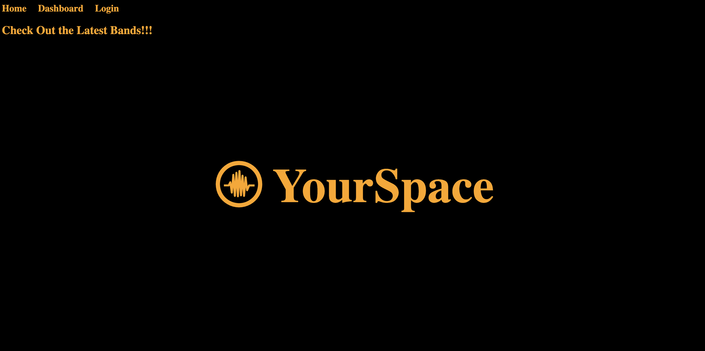

=======
# YourSpace

Link to Heroku App: 

  ## Table of Contents
  * [Description](#description)
  * [Installation](#installation)
  * [License](#license)
  * [Collaborators](#collaborators)
  * [Questions?](#questions?)

## Description
An MVC-powered blog for anything and everything in the world of music.

## Installation
  To install node, got to the nodejs.org website and click the link for the latest appropriate version. Next, run "npm i" from the command line to install all the required packages in this project. Documentation for each of these packages can be found on npmjs.com.

## License
  Click the badge at the top of this README for more information on this particular license.

## Collaborators
* https://github.com/JLIB047
* https://github.com/mjc01002
* https://github.com/holmesmainsend

## Questions?
  * GitHub: https://github.com/JLIB047
>>>>>>> b487159167243b0be7cfb3674351b015cc114b96
